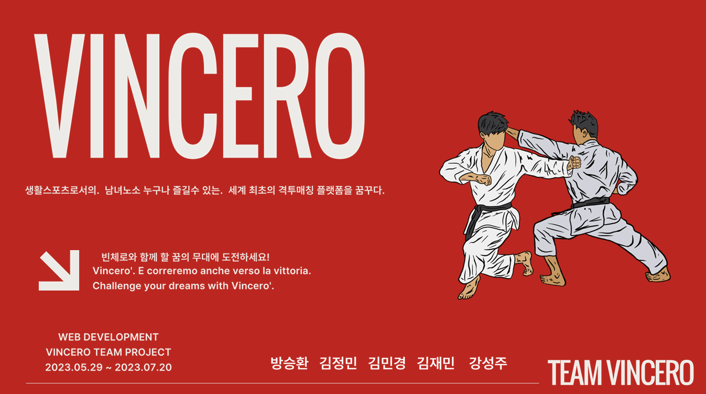
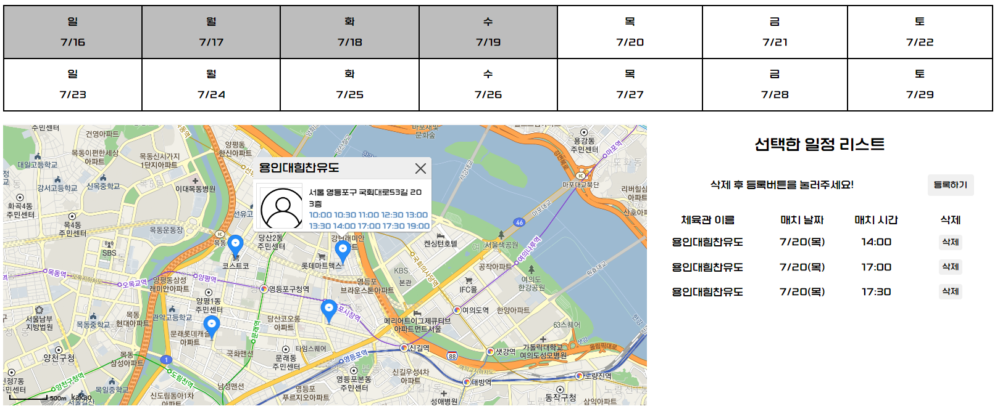
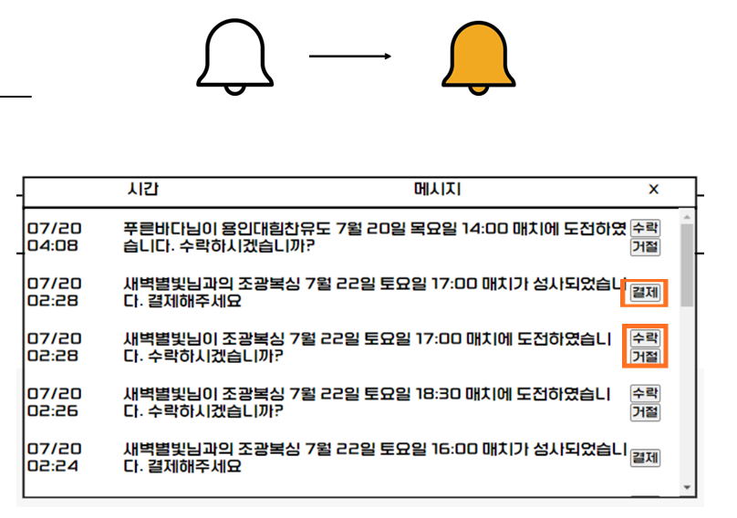
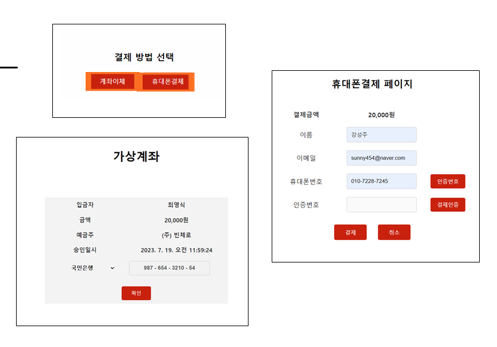
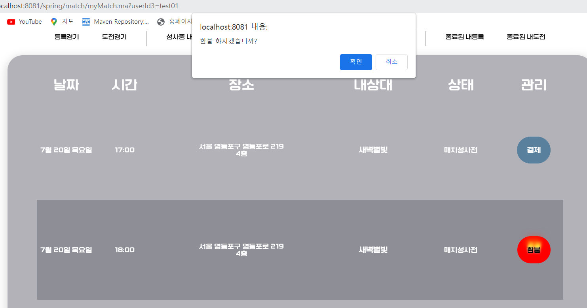
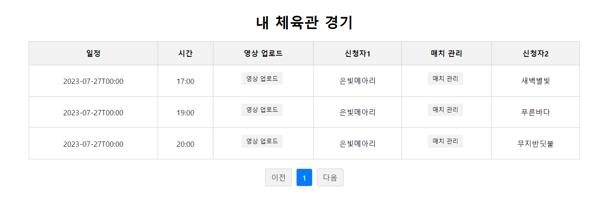
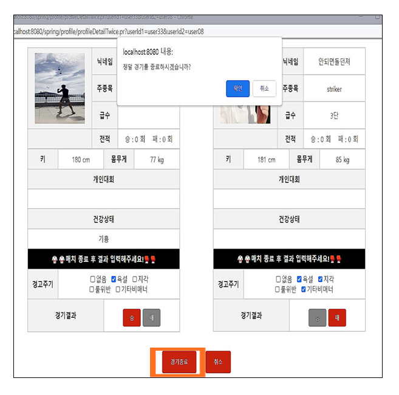

# "VINCERO" 팀 프로젝트

## #Spring 기반 "세계최초" 격투매칭 플랫폼
### <화면 목록>
* 메인화면
* 사용자(user)
  * 로그인화면
  * 매치등록화면
  * 매치도전신청화면
  * 랭킹화면
  * 고객센터
* 관장님(coach)    
  * 스케줄 등록화면
  * 매치 관리
  * 체육관 정보관리
* 관리자(admin)
  * 회원관리
  * 체육관 관리

### <맡은 파트>
1. 지도를 통한 일정관리
2. 알람 시스템
3. 결제 및 환불 시스템
4. 관장 시스템
5. git

### 1. 지도를 통한 일정관리

* 미리 관장이 등록해놓은 체육관 주소를 DB에서 가지고 와 geocoder를 이용해 위도, 경도를 구하고 그 위에 마커를 꼽는다.
마커를 클릭하면 체육관 이름, 주소, 관장이 앞서 등록해놓은 체육관 일정을 오버레이에 그려준다.
사용자는 원하는 시간을 클릭하면 지도 우측 선택한 일정 리스트에 장바구니처럼 체육관 이름, 날짜, 시간이 뜨게 되고 등록하기를 누르면 등록된다.

### 2. 알람 시스템

* 알람DB에 새로운 데이터가 생겼는지 setInterval()함수로 5초에 한 번씩 DB를 확인하고 새로운 데이터가 생기면 알람 종 이미지가 노란 종으로 바뀐다.
종을 누르면 모달창으로 화면이 뜬다. ajax를 이용해 구현하였다.
상대방이 매치도전신청을 걸어오면 알람메시지와 함께 수락, 거절 버튼이 생기고
수락 시 결제해달라는 알람메시지와 함께 결제버튼이 생긴다.
거절 시 거절되었다는 알람이 가게 된다.

### 3. 결제 및 환불 시스템

* 결제 버튼을 누르면 모달창으로 결제방법을 선택하라고 나오고
계좌이체나 휴대폰결제를 선택하면 팝업창으로 나타난다.
휴대폰결제는 API로 구현하지는 않았고 같은 팀원이 가입 파트에서 구현해놓은 인증번호 방식을 사용하여
인증번호가 같으면 결제가 되었다고 인식하게 프로그래밍 해놓았다.

* 매치를 취소하고 싶을 때 환불 버튼을 누르면 alert창으로 한 번 더 환불의사를 확인한 뒤 환불을 진행한다.

### 4. 관장 시스템

* 관장으로 로그인하면 메인에 보이는 화면이다.
내 체육관에서 열릴 매치의 날짜, 시간과 두 사용자의 닉네임을 확인할 수 있다.

* 매치관리를 누르면 두 사용자의 프로필을 조회할 수 있고, 매치가 다 끝났을 시에
각 사용자의 경고위반여부와 경기승패여부를 지정하여 종료하게끔 프로그래밍해놓았다.

## <후기>
교육 시 이론으로 배운 웹개발 사이클이 실습해도 잘 이해되지 않았는데 
직접 팀프로젝트를 통해 팀원들과 같이 개발을 진행해보니 빠르게 이해되었다.
한편으로, 팀으로 프로젝트를 진행하다보니 어려운 점이 있었다.
서로의 입장이 있고, 생각이 다른 부분들이 많았고 이런 부분들을 대화로 풀어나가는데 시간이 많이 걸렸지만, 최선의 방안으로 의견이 모아질 수 있었다. 
또한 서로 안 풀리는 부분은 도와가며 문제를 해결해나갈 수 있었다.
처음 만드는 시스템이다보니 구현해 보고 싶은 기능들이 많아 기획단계 때 다양한 아이디어들을 기획하였지만, 시간이 부족해 구현하지 못한 부분들도 있어 아쉬웠다.
이번 프로젝트를 통해 겪은 경험한 것들을 양분삼아 더 잘 할 수 있는 자신감을 얻게 되었다.